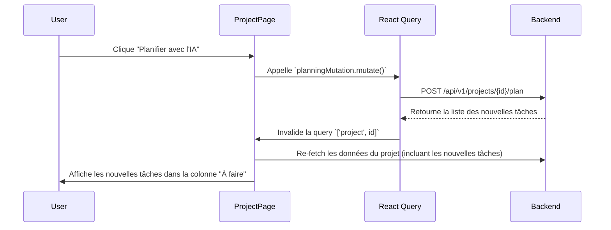
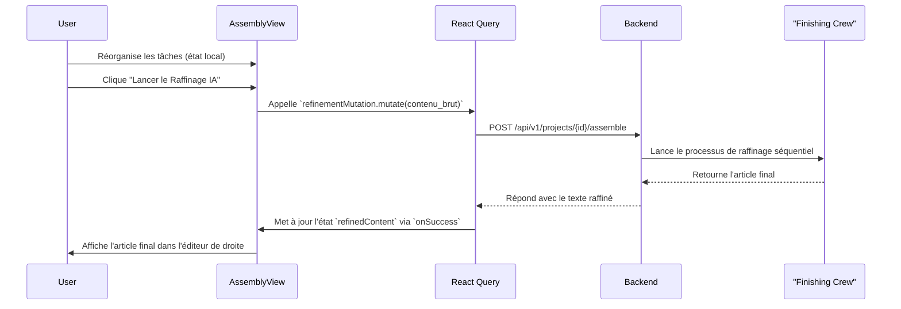

# Mémoire V2 - Architecture Technique Détaillée

Ce document décrit l'architecture technique de l'application, les choix de technologies, les modèles de données et les flux de travail principaux.

## 1. Vue d'Ensemble

L'application est une **Single-Page Application (SPA)** avec un backend découplé, conçue pour être robuste, évolutive et maintenable.

-   **Backend :** API RESTful en **Python 3.9+** avec **FastAPI**.
-   **Frontend :** Application **React 18+** avec **TypeScript** et **Vite**.
-   **Base de Données :** **PostgreSQL**, gérée par l'ORM **SQLAlchemy** et les migrations **Alembic**.
-   **Orchestration IA :** **`crewAI`** avec des modèles de langage servis par **Groq** (Llama 3).
-   **Déploiement :** **Docker** et **Docker Compose** pour un environnement de développement et de production cohérent.

---

## 2. Architecture Backend Détaillée

Le backend suit une architecture en couches pour une séparation claire des responsabilités.

### 2.1. Modèles de Données (`models.py`)

Les modèles définissent la structure de la base de données.

-   **`Project`**: Le conteneur principal.
    -   `id`: Clé primaire.
    -   `name`: Nom du projet (ex: "Article sur l'IA en 2025").
    -   `description`: Objectif détaillé du projet.
    -   `tasks`: Relation un-à-plusieurs avec le modèle `Task`.
-   **`Task`**: L'unité de travail atomique.
    -   `id`: Clé primaire.
    -   `project_id`: Clé étrangère liant la tâche à un `Project`.
    -   `title`: Titre de la tâche (ex: "Rédiger l'introduction").
    -   `description`: Contenu de la tâche, qui est mis à jour par les agents IA ou l'utilisateur.
    -   `status`: Chaîne de caractères qui représente la colonne du Kanban (ex: "À faire", "Révision", "Terminé").
    -   `order`: Entier pour définir l'ordre des tâches lors de la phase d'assemblage.

### 2.2. Service IA (`ai_service.py`)

C'est le cerveau de l'application. Il orchestre les agents `crewAI`.

-   **Agents Individuels :**
    -   `planner_agent`: Prend un objectif et génère une liste de titres de tâches.
    -   `researcher_agent`: Prend un titre de tâche et effectue une recherche web pour trouver des informations clés.
    -   `writer_agent`: Prend un titre et un contexte pour rédiger un paragraphe ou une section.
-   **Le "Crew de Finition" (`refine_article`) :** Une chaîne d'agents spécialisés qui travaillent séquentiellement pour polir un article complet.
    1.  `critic_agent`: Analyse la structure et la cohérence.
    2.  `style_agent`: Réécrit le texte pour améliorer le style, en se basant sur la critique précédente.
    3.  `fact_checker_agent`: Utilise l'outil `DuckDuckGoSearchRun` pour vérifier les faits dans le texte stylisé.
    4.  `proofreader_agent`: Effectue la correction finale de la grammaire et de l'orthographe.

### 2.3. API Endpoints (`/endpoints/`)

Les endpoints principaux exposent les fonctionnalités au frontend.

-   `POST /projects/{id}/plan`: Lance l'agent planificateur.
-   `POST /tasks/{id}/run-agent`: Délègue une tâche à un agent (chercheur ou rédacteur).
-   `POST /projects/{id}/assemble`: Lance le "Crew de Finition" sur les tâches terminées.
-   Endpoints CRUD standards pour `/projects` et `/tasks`.

---

## 3. Architecture Frontend Détaillée

Le frontend est conçu pour être interactif et réactif.

### 3.1. Composants Clés

-   **`ProjectPage.tsx`**: Le conteneur principal qui gère l'état de la page (vue Kanban ou vue Assemblage) et les appels API principaux via TanStack Query.
-   **`KanbanBoard.tsx`**:
    -   Utilise `dnd-kit` pour gérer toute la logique de glisser-déposer.
    -   Affiche les `KanbanColumn` et leur passe les tâches correspondantes.
    -   Gère l'état de la modale de détail (`TaskDetailsModal`).
-   **`TaskCard.tsx`**:
    -   Représente une tâche individuelle.
    -   Contient le menu `DropdownMenu` (Radix UI) pour les actions de délégation à l'IA.
    -   Déclenche l'ouverture de la modale de détail au clic.
-   **`TaskDetailsModal.tsx`**:
    -   Utilise le composant `Dialog` (Radix UI).
    -   Intègre le `RichTextEditor` pour permettre la visualisation et la modification du contenu de la tâche.
-   **`AssemblyView.tsx`**:
    -   Interface à deux panneaux pour la phase finale.
    -   Panneau de gauche : une liste de tâches réorganisable avec `dnd-kit`.
    -   Panneau de droite : le `RichTextEditor` pour l'aperçu et le résultat du raffinage IA.
-   **`RichTextEditor.tsx`**:
    -   Basé sur **Tiptap**, configuré en mode "headless".
    -   Son style est entièrement contrôlé par le plugin `@tailwindcss/typography`.
    -   Accepte du contenu initial et notifie les changements via des props (`initialContent`, `onContentChange`).

### 3.2. Gestion de l'État

-   **TanStack Query (React Query)** est utilisé pour toutes les interactions avec le backend. Cela simplifie la mise en cache, la revalidation automatique des données et la gestion des états de chargement/erreur.
-   Les mutations de React Query (`useMutation`) sont utilisées pour toutes les actions qui modifient les données (mise à jour d'une tâche, lancement d'un agent), avec une revalidation automatique des données du projet en cas de succès.

---

## 4. Flux de Travail Détaillés

### 4.1. Planification d'un Projet

### 4.2. Assemblage et Raffinage d'un Article

