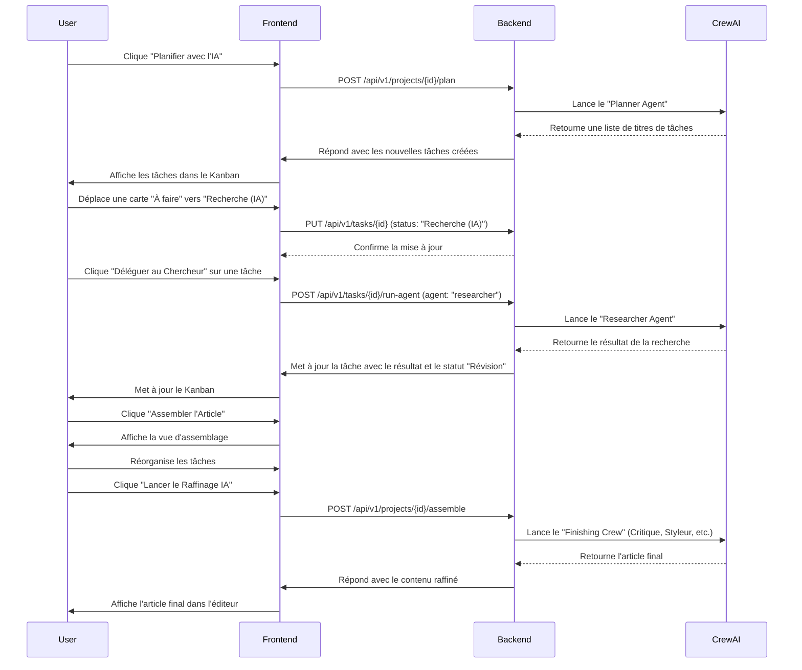

# Architecture v2 - GeekBlog Content Command Center

Ce document décrit l'architecture technique de la v2 de GeekBlog, un système conçu pour transformer la création de contenu en un workflow collaboratif Homme-IA.

## 1. Vision Générale

L'application est un "Content Command Center" qui permet de décomposer la création d'un article de blog en tâches granulaires, d'automatiser certaines de ces tâches via des agents IA, et de superviser le processus dans une interface visuelle de type Kanban.

## 2. Architecture Technique

Le système est une application web moderne composée de deux parties principales :

-   **Backend :** Une API RESTful développée avec **Python** et **FastAPI**.
-   **Frontend :** Une Single-Page Application (SPA) développée avec **React**, **TypeScript** et **Vite**.

### 2.1. Backend

Le backend est structuré de manière modulaire pour une séparation claire des responsabilités.

-   **API (`/api`) :** Gère les routes HTTP. Les endpoints sont organisés par ressource (`projects`, `tasks`, etc.) et versionnés (`/v1`).
-   **Services (`/services`) :** Contient la logique métier principale.
    -   `project_service.py`, `task_service.py`: Logique CRUD pour les projets et les tâches.
    -   `ai_service.py`: Le cœur de l'intelligence artificielle. Il utilise **`crewAI`** pour définir, orchestrer et exécuter des équipes d'agents IA spécialisés.
-   **Modèles (`/models`) :** Définit la structure de la base de données avec **SQLAlchemy ORM**. Les modèles principaux sont `Project` et `Task`.
-   **Schémas (`/schemas`) :** Définit les formes des données pour l'API avec **Pydantic**, assurant la validation et la sérialisation.
-   **Base de Données (`/db`) :** Gérée par **PostgreSQL** et les migrations sont contrôlées par **Alembic**.

### 2.2. Frontend

Le frontend est construit avec une stack moderne axée sur la performance et l'expérience développeur.

-   **State Management :** **`TanStack Query (React Query)`** est utilisé pour la gestion de l'état serveur (fetching, caching, updating des données de l'API). L'état local de l'UI est géré avec les hooks de React (`useState`, `useEffect`).
-   **Styling :** **`Tailwind CSS`** est utilisé pour le style, avec une configuration personnalisée (`tailwind.config.js`) qui s'appuie sur des variables CSS pour implémenter le design system "Neural Flow". Le plugin `@tailwindcss/typography` est utilisé pour styliser le contenu généré.
-   **Composants UI :** Les composants de base (boutons, menus, dialogues) sont construits avec **`Radix UI`** (via `shadcn/ui`), garantissant l'accessibilité et une base solide.
-   **Drag-and-Drop :** La fonctionnalité de glisser-déposer du Kanban est implémentée avec **`dnd-kit`**.
-   **Structure des Composants :**
    -   `/pages`: Composants de haut niveau qui correspondent aux routes de l'application (ex: `ProjectPage.tsx`).
    -   `/components`: Composants réutilisables, organisés par fonctionnalité (ex: `/kanban`, `/editor`, `/assembly`).
    -   `/lib`: Logique non-visuelle partagée, comme les appels API (`api.ts`) et les constantes (`constants.ts`).

## 3. Workflow de Données et d'Interaction

Le diagramme ci-dessous illustre le flux de travail principal, de la planification à l'assemblage.

